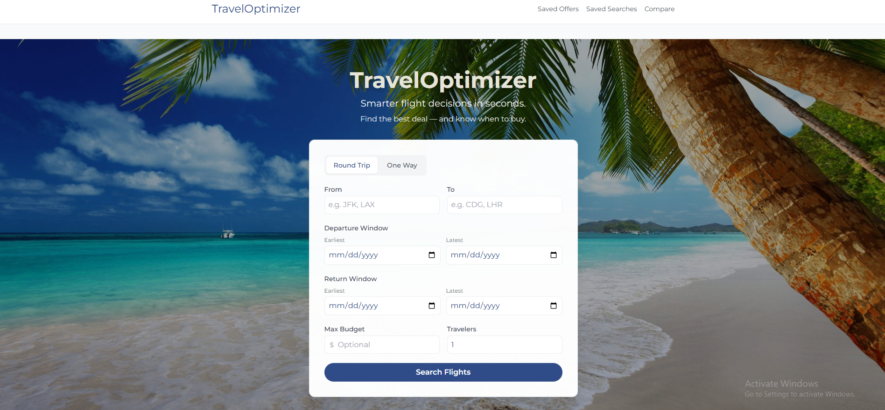
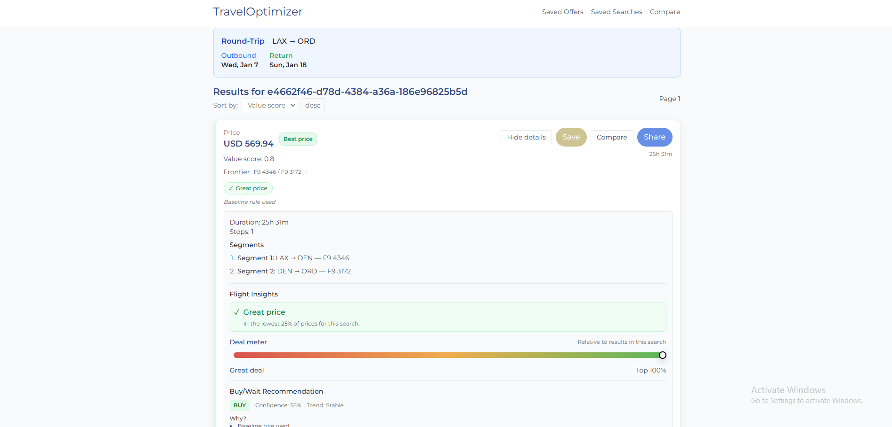
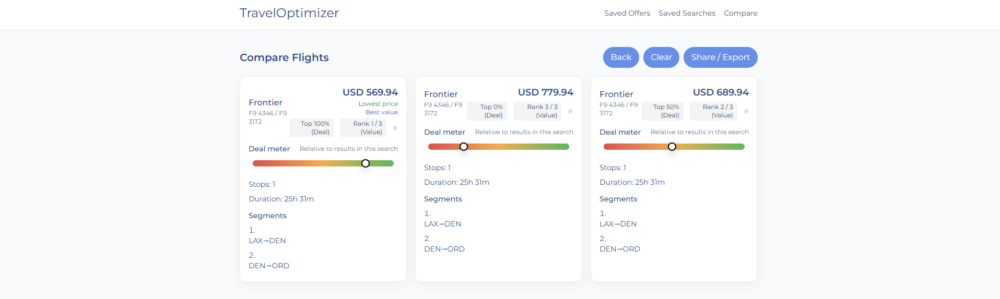

# TravelOptimizer

TravelOptimizer is a developer-focused prototype for smarter flight decisions. It fetches real flight offers (Amadeus), normalizes results, scores each offer with a Value Score, and provides a Buy/Wait recommendation (ML or baseline heuristic) and comparison tools to help users decide.

Demo

The following screenshots walk through the main flows:

- Hero page: frontend/public/images/heropage.png

  

  Caption: Landing view with branding and the primary search form. The hero highlights the app value and contains the centered search card used to start searches.

- Search form: frontend/public/images/searchform.png

  

  Caption: Focused view of the search form showing origin, destination, date window, and trip type toggles. Submitting this form posts to `/api/trips/search` and navigates to results.

- Results page: frontend/public/images/resultspage.png

  

  Caption: Paginated search results with price, Value Score, Deal Meter, and quick actions. Click "View Details" for the score breakdown and Buy/Wait recommendation.

- Compare page: frontend/public/images/comparePage.png

  

  Caption: Side-by-side comparison of saved offers. Useful fields are price, duration, stops, and the Value Score to help decide between options.

Key features

- Search and browsing
  - Date window searches (earliest/latest), one-way and round-trip.
  - Pagination for options via backend pagination endpoint.
  - View details per option that exposes price, segments, flags, and score breakdown when available.
- Decision support
  - Value Score (0-1) ranks offers relative to other offers within the same search.
  - Deal Meter shows percentile position within the current search.
  - Buy/Wait recommendation comes from an ML client or a built-in baseline rule set when ML is disabled.
- Productivity
  - Save offers and saved searches (server-backed, requires `X-Client-Id` header set by the frontend). 
  - Compare up to 3 offers side-by-side. 
  - Export / share saved offers.
- Engineering
  - Provider abstraction (mock and Amadeus implementations). 
  - Optional Redis caching and Micrometer metrics with Spring Actuator. 
  - Integration tests using Testcontainers and WireMock.

Architecture overview

Frontend (Vite / React / TypeScript) -> Backend API (Spring Boot) -> Provider (Amadeus)

Backend -> DB (Postgres via Flyway)

Backend -> Cache (optional Redis)

Backend -> ML (internal baseline or external ML service client)

Tech stack

- Frontend: React, TypeScript, Vite, Tailwind CSS, react-router-dom, react-query, react-hook-form, zod, vitest.
- Backend: Spring Boot (Java 17), Spring WebMVC/WebFlux, Spring Data JPA, Flyway, Spring Cache/Redis support, Micrometer, Actuator, Resilience4j.
- Data: Postgres (recommended), H2 for lightweight dev.
- Testing: JUnit 5, Spring Boot test starters, Testcontainers (Postgres), WireMock.
- Tooling: Maven, Node/npm, Docker, PowerShell helper scripts for Windows developers.

Local setup and run

Prerequisites

- Java 17
- Maven
- Node 18+ and npm
- Docker (optional, required for full Postgres+Redis mode)

Environment variables (descriptions only; do not commit secrets)

- `AMADEUS_API_KEY`, `AMADEUS_API_SECRET`: Amadeus credentials used by the Amadeus provider.
- `TRAVEL_PROVIDERS_FLIGHTS`: flight provider selection; set to `amadeus` to enable Amadeus provider.
- `ML_ENABLED` or `ml.enabled`: enable ML calls. See `scripts/run-backend.ps1` for mappings.
- `VITE_API_BASE_URL`: frontend API base. When unset in dev the Vite proxy forwards `/api` to `http://localhost:8080`.
- Spring datasource vars: `SPRING_DATASOURCE_URL`, `SPRING_DATASOURCE_USERNAME`, `SPRING_DATASOURCE_PASSWORD`.

Recommended run modes

Mode 1: Fast dev with H2 (no Docker)

1. Backend (PowerShell):

```powershell
pwsh .\scripts\run-backend.ps1 -Db h2
```

This builds and runs the Spring Boot jar against an in-memory H2 database. Backend listens on port 8080.

2. Frontend:

```bash
cd frontend
npm install
npm run dev
```

Frontend dev server defaults to port 5173; Vite will proxy `/api` to `http://localhost:8080` when `VITE_API_BASE_URL` is not set.

Mode 2: Full dev with Docker (Postgres + Redis)

1. Start Docker services:

```bash
docker compose up -d
```

Docker compose maps Postgres container port 5432 to host 5433 by default.

2. Backend (PowerShell):

```powershell
pwsh .\scripts\run-backend.ps1 -Db postgres
```

3. Frontend: same as Mode 1.

Notes

- `scripts/run-backend.ps1` looks for `.env.amadeus` and `.env.postgres` and maps common keys to Spring variables. It will attempt to start the Docker dev stack if Postgres is not reachable.
- If `VITE_API_BASE_URL` is set to an absolute URL, the frontend uses that and bypasses the Vite proxy. Leave it unset for local dev convenience.

How to use (user flow)

1. Open the frontend, enter origin/destination and date window, choose one-way or round-trip and run a search.
2. Browse paginated options. Each option shows price, segments, value score and flags.
3. Click View Details for score breakdown and Buy/Wait reasoning.
4. Save offers for later review. Compare up to 3 saved offers.

Testing

- Run backend unit and integration tests:

```bash
mvn test
```

Integration tests that use Testcontainers require Docker available.

- Frontend tests:

```bash
cd frontend
npm run test
```

API documentation (selected endpoints)

- POST `/api/trips/search` — submit a search payload (origin, destination, date windows, travelers). Returns `TripSearchResponseDTO` including `options`.
- GET `/api/trips/{searchId}/options` — pagination for a search. Query params `page`, `size`, `sortBy`, `sortDir`.
- GET `/api/trips/recent` — list recent searches.
- POST/GET/DELETE `/api/saved` — saved searches (requires `X-Client-Id` header).
- POST/GET/DELETE `/api/saved/offers` — saved offers (requires `X-Client-Id` header).
- POST `/api/feedback` — send UI feedback events (fire-and-forget).
- Actuator: `/actuator/health`, `/actuator/metrics` when enabled by profile.

Roadmap (suggested, short)

- Add richer ML explanations and per-feature weight breakdown for Value Score.
- Improve caching layer with Redis fallback for provider results.
- Add end-to-end tests for frontend flows using Playwright or Cypress.

License

No license file detected. Marked as: TBD.
Traveloptimizer — Local Development

## Local Dev

This project runs a Spring Boot backend and a Vite-based frontend. The backend expects a PostgreSQL database for local development.

1) Start Postgres with Docker Compose

PowerShell:

    # Copy the example file and set real secrets (do NOT commit this file)
    Copy-Item .env.postgres.example .env.postgres
    # Edit .env.postgres and set a secure password
    docker compose up -d postgres

2) Set required environment variables (PowerShell)

    # $env:SPRING_DATASOURCE_URL points to the DB. Example:
    $env:SPRING_DATASOURCE_URL = 'jdbc:postgresql://localhost:5433/traveloptimizer'
    $env:SPRING_DATASOURCE_USERNAME = 'postgres'
    $env:SPRING_DATASOURCE_PASSWORD = 'your_db_password'

    # Optional: export DB_* fallback variables if scripts expect them
    $env:DB_URL = $env:SPRING_DATASOURCE_URL
    $env:DB_USERNAME = $env:SPRING_DATASOURCE_USERNAME
    $env:DB_PASSWORD = $env:SPRING_DATASOURCE_PASSWORD

3) Start the backend

    # mvn may need JAVA_HOME pointing to JDK 17
    mvn -DskipTests spring-boot:run

4) Start the frontend

    cd frontend
    npm install
    npm run dev

5) Verify the backend

    # Check actuator health
    curl http://localhost:8080/actuator/health

Notes:
 - The compose file exposes Postgres on host port 5433 and configures the container to listen on 5433 for consistency with local dev.
 - Do NOT commit `.env.postgres` containing real passwords. Use `.env.postgres.example` as a template.
# Local dev: `dev-no-security` profile

This repository includes a temporary development-only profile `dev-no-security` that disables authentication for local verification.

How to run (local only):

1. Build the jar:

```powershell
mvn -DskipTests clean package
```

2. Run with the dev profile (H2 in-memory datasource will be used):

```powershell
java -jar target/*-SNAPSHOT.jar --spring.profiles.active=dev-no-security
```

Notes:
# Intelligent Travel Cost Optimizer (backend)

This is a Spring Boot 3.x backend (Java 17+) for the Intelligent Travel Cost Optimizer project.

Quick start

1. Create a local `.env` file from `.env.example` and fill in `DB_PASSWORD` (do NOT commit `.env`).

2. Load the `.env` variables into your PowerShell session (example):

```powershell
(Get-Content .env) -split "`r?`n" | ForEach-Object {
  if ($_ -and -not $_.StartsWith('#')) {
    $parts = $_ -split '=',2
    if ($parts.Length -eq 2) { [System.Environment]::SetEnvironmentVariable($parts[0], $parts[1], 'Process') }
  }
}
mvn spring-boot:run
```

Running tests

Unit and integration tests are executed with Maven. Integration tests use Testcontainers to run a temporary PostgreSQL instance.

```powershell
mvn test
```

CI


Notes


**Testing & Integration Setup**

  - `POST /predict/best-date-window` → 200 JSON
  - `POST /predict/option-recommendation` → 200 JSON
  - Quick: `mvn test` (integration tests start Docker containers via Testcontainers)
  - If you need unit-only runs: run specific tests with `-Dtest=...` or use test categories/naming conventions.

Amadeus integration (optional)
- To enable Amadeus Self-Service flight offers locally, set the following env vars (do NOT commit secrets):
  - `AMADEUS_API_KEY` and `AMADEUS_API_SECRET`
- Then set `amadeus.enabled=true` (e.g., export/set env var) and optionally `amadeus.base-url` (test API is default).
- The code respects caching and a short timeout to avoid hitting Amadeus rate limits. Tests use WireMock and do not call the real Amadeus API.
